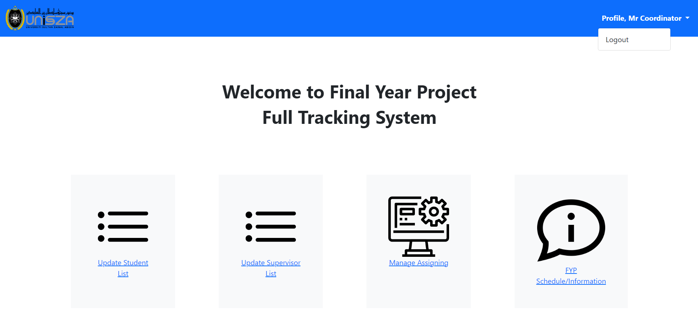

# 🎓 FYP Full Tracking System

A web-based system developed to **streamline the management of Final Year Projects (FYP)** for students and faculty members at the Faculty of Informatics and Computing, **Universiti Sultan Zainal Abidin (UniSZA)**.

This system provides a centralized digital platform that automates supervisor assignment, tracks student progress, and enables coordinators, supervisors, and students to collaborate more efficiently throughout the FYP lifecycle.

---

## 🧩 Table of Contents
- [🎯 Project Objectives](#-project-objectives)
- [🚀 Features](#-features)
- [🧰 Tech Stack](#-tech-stack)
- [🧠 System Overview](#-system-overview)
- [⚙️ Installation Guide](#️-installation-guide)
- [🧮 Algorithm Used (AHP)](#-algorithm-used-ahp)
- [🖼️ Screenshots](#️-screenshots)
- [🧪 Testing Summary](#-testing-summary)
- [📊 Future Enhancements](#-future-enhancements)
- [👤 Author](#-author)

---

## 🎯 Project Objectives
1. To study the existing approaches of managing Final Year Projects.  
2. To develop a system that helps monitor student progress and automatically assign supervisors efficiently.  
3. To test and evaluate the functionality and usability of the proposed system.

---

## 🚀 Features

### 👨‍🎓 Student Module
- Register and log in securely.  
- View assigned supervisor automatically (based on project field and CGPA).  
- Submit project title, abstracts, and progress reports.  
- View FYP schedules and announcements.  
- Upload project presentation slides and posters.

### 🧑‍🏫 Supervisor Module
- Log in and manage profile information.  
- Update area of expertise and preferred project types.  
- Monitor assigned student progress.  
- Provide comments and grades on student submissions.

### 🧑‍💼 Coordinator Module
- Manage student and supervisor records.  
- Automatically assign supervisors using **AHP (Analytic Hierarchy Process)**.  
- Manage announcements, schedules, and project information.  
- View FYP progress and grading status.

---

## 🧰 Tech Stack
| Category | Technology |
|-----------|-------------|
| Frontend | HTML, CSS, JavaScript, Bootstrap 5 |
| Backend | PHP |
| Database | MySQL (via phpMyAdmin) |
| IDE | Visual Studio Code |
| Methodology | Agile (Plan → Design → Develop → Test → Deploy → Review) |

---

## 🧠 System Overview

### Framework Design
Three main users interact with the system:
- **Coordinator** — manages students, supervisors, and assignments.
- **Supervisor** — monitors and evaluates student progress.
- **Student** — submits and tracks project progress.

### Database Tables
- `student`
- `supervisor`
- `coordinator`
- `project_details`
- `pairwise`
- `fyp_information`

---

## 🖼️ System Screenshots & Description

Below are the main interfaces of the **FYP Full Tracking System**, demonstrating the roles of Coordinator, Supervisor, and Student users.

---

### 🔐 Login Interface
  
Students, Supervisors, and Coordinators log in using their respective credentials. The login form validates user input and redirects them to their appropriate dashboard based on role.

---

### 🧑‍💼 Coordinator Module

#### 🏠 Coordinator Dashboard
  
The Coordinator’s main page contains navigation menus for managing students, supervisors, assignments, and FYP information. The UniSZA logo and profile details are displayed on the top navigation bar.

---

#### 👨‍🎓 Update Student List
  
Coordinators can upload a student list (CSV file) or manually add students. All added students appear in a data table where records can be deleted if needed.

---

#### 🧑‍🏫 Update Supervisor List
  
This page allows the Coordinator to upload or manually add Supervisor details. The existing supervisor list is displayed below, with options to remove or update entries.

---

#### 🔄 Manage Assigning (AHP Allocation)
  
This page enables Coordinators to manage the AHP (Analytic Hierarchy Process) criteria and assign students to supervisors automatically based on expertise and workload. It includes:
- Pairwise value management  
- Scope addition/editing  
- Viewing assigned/unassigned students  

---

#### ✏️ Update Project Scope
  
The Coordinator can edit existing project scopes and assign them to relevant study programs.

---

#### 📋 Assigned Student List
  
Displays all students who have been successfully assigned to supervisors. Coordinators can click supervisor names to view their student details and progress.

---

#### 📈 Student Progress Monitoring
  
Coordinators can monitor FYP progress of each assigned student, including grades and feedback provided by supervisors.

---

#### ⚠️ Unassigned Students
  
Shows the list of students who have not yet been assigned to supervisors. Coordinators can review missing project details and take action.

---

#### 📅 FYP Schedule & Announcements
  
The Coordinator can add, edit, or delete announcements and schedule information for FYP activities. Students will see these updates in their dashboard.

---

### 🧑‍🏫 Supervisor Module

#### 🏠 Supervisor Dashboard
  
The Supervisor’s main page provides quick access to update their profile and manage FYP progress (FYP1 & FYP2).

---

#### 👤 Update Profile (Expertise)
  
Supervisors update their expertise area and preferred project types, which are used in the AHP algorithm to match them with suitable students.

---

#### 📚 Assigned Student List (Supervisor)
  
Displays all students assigned to a particular supervisor. Supervisors can view each student’s project details and submission progress.

---

#### 🧾 Student Progress & Review
  
Supervisors can download or view submitted progress reports, write reviews, and assign proposal/report grades. The review area is enabled only when students have uploaded progress files.

---

#### 🔒 Change Password (Supervisor)
  
Supervisors can securely update their passwords by entering their old password and setting a new one that meets strength criteria (8+ chars, mixed case, symbol).

---

### 👨‍🎓 Student Module

#### 🏠 Student Dashboard
  
The Student dashboard contains three main menus: Supervisor, FYP1/FYP2, and FYP Information. The top bar displays profile info and logout options.

---

#### 🧑‍🏫 Supervisor Assignment (Student)
  
Students enter their project title, choose the project scope, and upload relevant submissions. The system automatically assigns a supervisor based on the selected scope using the AHP method.

---

#### 📤 FYP Progress Submission (Student)
  
Students upload their progress documents. Once reviewed by the supervisor, comments and grades are displayed beside the uploaded file list.

---

#### 📆 FYP Schedule / Information (Student)
  
Students can view important FYP announcements, timelines, and schedule updates posted by the Coordinator.

---

#### 🔑 Change Password (Student)
  
Students can securely change their password following strong password rules similar to supervisors.

---

## 🧠 Summary
These screenshots illustrate the major system modules for Coordinator, Supervisor, and Student roles, covering full functionality from user authentication to FYP submission and monitoring.


## ⚙️ Installation Guide

```bash
# Clone the repository
git clone https://github.com/yourusername/fyp-full-tracking-system.git
cd fyp-full-tracking-system

# Place files inside your XAMPP 'htdocs' folder
# Example: C:\xampp\htdocs\fyp-full-tracking-system

# Start Apache and MySQL via XAMPP Control Panel

# Import the SQL file (fyp_system.sql) into phpMyAdmin

# Access the system in your browser
http://localhost/fyp-full-tracking-system


